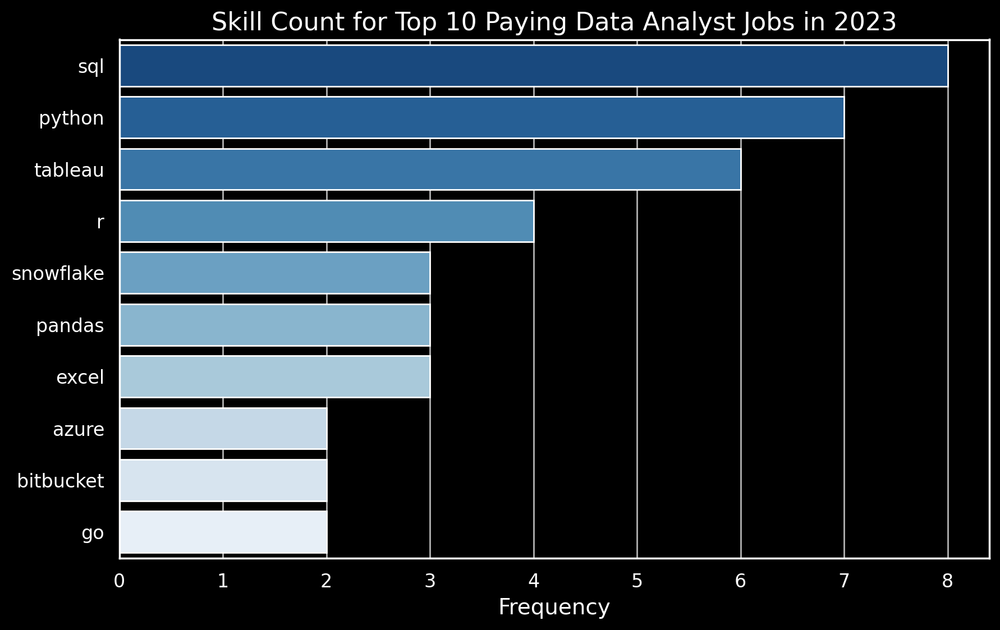

# Data Analyst Job Market Analysis

## Project Overview

This project explores the **data analyst job market** to identify which skills offer the best career value based on demand and salary. Using SQL, I analyzed job posting data to uncover trends in compensation, required skills, and overall market demand.

The analysis focuses on remote data analyst roles and examines how different skills influence both earning potential and hiring demand. By combining multiple queries, this project highlights which skills are most valuable for aspiring data analysts to prioritize.

### **SQL Queries 🔍** 

The full SQL queries used in this analysis can be found here: [project_sql](/project_sql/)

## Business Questions

This analysis focuses on the following key questions:

1. What are the top-paying data analyst jobs?
2. What skills are required for these top-paying jobs?
3. What skills are most in demand for data analysts?
4. Which skills are associated with higher salaries?
5. What are the most optimal skills to learn?

## Approach

To analyze the data analyst job market, I worked with a dataset of job postings containing information on roles, salaries, locations, and required skills.

I began by filtering the dataset to focus on data analyst roles with available salary data, primarily targeting remote positions. I then joined multiple tables to combine job details with associated skill requirements.

Using aggregation techniques, I analyzed salary trends and skill demand by calculating metrics such as average salary and frequency of skill occurrence. This allowed me to compare which skills are both highly demanded and well compensated.

Finally, I combined demand and salary insights to identify skills that offer the best overall career value.

### Tools 🛠️

- **SQL (PostgreSQL):** Used to query, join, and analyze job posting data
- **Visual Studio Code:** Used to write and manage SQL queries
- **Git & GitHub:** Used for version control and project documentation

## Key Insights 💡

- **SQL remains a core skill across the market:** It appears consistently in both high-demand and high-paying roles, making it a foundational requirement for data analysts.

- **Higher salaries are associated with broader technical skills:** Roles with higher compensation often require additional tools such as Python and data visualization platforms, indicating the value of a more advanced skill set.

- **Specialized tools command premium salaries:** Skills related to big data, cloud platforms, and machine learning tend to offer higher average salaries, even if they appear less frequently in job postings.

- **High demand does not always mean high salary:** Tools like Excel are widely required but are less associated with top-paying roles, suggesting they are baseline skills rather than differentiators.

- **Combining demand and salary highlights high-value skills:** Skills such as SQL, Python, and cloud technologies provide a strong balance between market demand and earning potential.

## Analysis 🔍
Each query for this project aimed at investigating specific aspects of the data analyst job market. Here’s how I approached each question:

### 1. Top Paying Data Analyst Jobs
To identify the highest-paying roles, I filtered data analyst positions by average yearly salary and location, focusing on remote jobs. This query highlights the high paying opportunities in the field.

```sql
SELECT
    job_id,
    job_title,
    job_location,
    job_schedule_type,
    salary_year_avg,
    job_posted_date,
    name AS company_name
FROM
    job_postings_fact
LEFT JOIN
    company_dim
    ON job_postings_fact.company_id = company_dim.company_id
WHERE
    job_title_short = 'Data Analyst' AND
    job_location = 'Anywhere' AND
    salary_year_avg IS NOT NULL
ORDER BY
    salary_year_avg DESC
LIMIT 10;
```
**Key Insights:**
- Top-paying data analyst roles show a wide salary range, with some positions reaching up to $650K, indicating significant variation based on role scope and seniority.
- High salaries are offered across different types of companies, suggesting strong demand for data analysts across multiple industries.


*Figure 1: Bar graph showing the top 10 highest-paying data analyst roles.*

### 2. Skills for Top Paying Jobs

This analysis examines the skills required for the highest-paying data analyst roles by linking job postings with their associated skill sets.

```sql
WITH top_paying_jobs AS (
    SELECT
        job_id,
        job_title,
        salary_year_avg,
        name AS company_name
    FROM
        job_postings_fact
    LEFT JOIN
        company_dim
        ON job_postings_fact.company_id = company_dim.company_id
    WHERE
        job_title_short = 'Data Analyst' AND
        job_location = 'Anywhere' AND
        salary_year_avg IS NOT NULL
    ORDER BY
        salary_year_avg DESC
    LIMIT 10
)
SELECT 
    top_paying_jobs.*,
    skills
FROM top_paying_jobs
INNER JOIN 
    skills_job_dim
    ON top_paying_jobs.job_id = skills_job_dim.job_id
INNER JOIN
    skills_dim
    ON skills_job_dim.skill_id = skills_dim.skill_id
ORDER BY
    salary_year_avg DESC
```
**Key Insights:**
- **SQL is consistently required** across top-paying roles, reinforcing its importance as a core skill for data analysts.
- **Python and Tableau frequently appear** alongside SQL, indicating that higher-paying roles often require both programming and data visualization capabilities.


*Bar Graph showing the most common skills required for top-paying data analyst roles*

### 3. In-Demand Skills for Data Analysts

This analysis identifies the most frequently requested skills in data analyst job postings, focusing on remote roles.

```sql
SELECT 
    skills,
    COUNT (skills_job_dim.job_id) AS demand_count
FROM job_postings_fact
INNER JOIN 
    skills_job_dim
    ON job_postings_fact.job_id = skills_job_dim.job_id
INNER JOIN
    skills_dim
    ON skills_job_dim.skill_id = skills_dim.skill_id
WHERE
    job_postings_fact.job_title_short = 'Data Analyst' AND
    job_work_from_home = TRUE
GROUP BY
    skills
ORDER BY
    demand_count DESC
LIMIT 5;
```
**Key Insights:**
- **SQL and Excel dominate demand**, indicating they are baseline skills expected in most data analyst roles.
- **Programming and visualization tools are increasingly important**, with Python, Tableau, and Power BI frequently appearing in job requirements.

| Skill      | Demand Count |
|------------|--------------|
| SQL        | 7,291        |
| Excel      | 4,611        |
| Python     | 4,330        |
| Tableau    | 3,745        |
| Power BI   | 2,609        |

*Table showing the demand for the Top 5 skills in data analyst job postings*

### 4. Skills Based on Salary

This analysis explores the average salary associated with different skills to identify which ones are linked to higher-paying data analyst roles.

```sql
SELECT 
    skills,
    ROUND (AVG (salary_year_avg), 0) AS avg_salary
FROM job_postings_fact
INNER JOIN 
    skills_job_dim
    ON job_postings_fact.job_id = skills_job_dim.job_id
INNER JOIN
    skills_dim
    ON skills_job_dim.skill_id = skills_dim.skill_id
WHERE
    job_postings_fact.job_title_short = 'Data Analyst' AND
    salary_year_avg IS NOT NULL AND
    job_work_from_home = TRUE
    -- AND job_work_from_home = TRUE
GROUP BY
    skills
ORDER BY
    avg_salary DESC
LIMIT 25;
```
**Key Insights:**
- **Specialized and technical skills are associated with higher salaries**, particularly those related to big data, machine learning, and cloud platforms. For example, PySpark ($208K), Couchbase ($160K), and DataRobot ($155K) are among the highest-paying skills.

- **Higher-paying skills tend to be less common**, suggesting that niche expertise can command a salary premium. Tools like Bitbucket and Elasticsearch appear less frequently in job postings but are associated with relatively high average salaries.

| Skill        | Average Salary ($) |
|--------------|--------------------|
| PySpark      | 208,172            |
| Bitbucket    | 189,155            |
| Watson       | 160,515            |
| Couchbase    | 160,515            |
| DataRobot    | 155,486            |
| GitLab       | 154,500            |
| Swift        | 153,750            |
| Jupyter      | 152,777            |
| Pandas       | 151,821            |
| Elasticsearch| 145,000            |

*Table showing the Top 10 highest-paying skills for data analysts*

### 5. Most Optimal Skills to Learn

This analysis identifies skills that offer the best overall career value by balancing market demand and average salary, highlighting which skills are both widely required and well-compensated.

```sql
WITH skills_demand AS (
    SELECT 
        skills_dim.skill_id,
        skills_dim.skills,
        COUNT (skills_job_dim.job_id) AS demand_count
    FROM job_postings_fact
    INNER JOIN 
        skills_job_dim
        ON job_postings_fact.job_id = skills_job_dim.job_id
    INNER JOIN
        skills_dim
        ON skills_job_dim.skill_id = skills_dim.skill_id
    WHERE
        job_postings_fact.job_title_short = 'Data Analyst' AND
        salary_year_avg IS NOT NULL AND
        job_work_from_home = TRUE
    GROUP BY
        skills_dim.skill_id,
        skills_dim.skills
),  avg_salary AS (
    SELECT 
        skills_job_dim.skill_id,
        skills_dim.skills,
        ROUND (AVG (salary_year_avg), 0) AS avg_salary
    FROM job_postings_fact
    INNER JOIN 
        skills_job_dim
        ON job_postings_fact.job_id = skills_job_dim.job_id
    INNER JOIN
        skills_dim
        ON skills_job_dim.skill_id = skills_dim.skill_id
    WHERE
        job_postings_fact.job_title_short = 'Data Analyst' AND
        salary_year_avg IS NOT NULL AND
        job_work_from_home = TRUE
    GROUP BY
        skills_job_dim.skill_id,
        skills_dim.skills
)

SELECT
    skills_demand.skill_id,
    skills_demand.skills,
    demand_count,
    avg_salary
FROM
    skills_demand
INNER JOIN
    avg_salary
    ON skills_demand.skill_id = avg_salary.skill_id
WHERE
    demand_count > 10
ORDER BY
    avg_salary DESC,
    demand_count DESC
LIMIT 25;

-- Below is The Alternative Query
SELECT
    skills_dim.skill_id,
    skills_dim.skills,
    COUNT (skills_job_dim.job_id) AS demand_count,
    ROUND (AVG (salary_year_avg), 0) AS avg_salary
FROM
    job_postings_fact
INNER JOIN
    skills_job_dim 
    ON job_postings_fact.job_id = skills_job_dim.job_id
INNER JOIN
    skills_dim 
    ON skills_job_dim.skill_id = skills_dim.skill_id
WHERE
    job_postings_fact.job_title_short = 'Data Analyst' AND
    job_postings_fact.salary_year_avg IS NOT NULL AND
    job_postings_fact.job_work_from_home = TRUE
GROUP BY
    skills_dim.skills,
    skills_dim.skill_id
HAVING
    COUNT (skills_job_dim.job_id) > 10
ORDER BY
    avg_salary DESC,
    demand_count DESC
LIMIT 25;
```
**Key Insights:**

- **High-Demand Programming Languages:** Python and R stand out for their high demand, with demand counts of 236 and 148 respectively. Despite their high demand, their average salaries are around $101,397 for Python and $100,499 for R, indicating that proficiency in these languages is highly valued but also widely available.
- **Cloud Tools and Technologies:** Skills in specialized technologies such as Snowflake, Azure, AWS, and BigQuery show significant demand with relatively high average salaries, pointing towards the growing importance of cloud platforms and big data technologies in data analysis.
- **Business Intelligence and Visualization Tools:** Tableau and Looker, with demand counts of 230 and 49 respectively, and average salaries around $99,288 and $103,795, highlight the critical role of data visualization and business intelligence in deriving actionable insights from data.
- **Database Technologies:** The demand for skills in traditional and NoSQL databases (Oracle, SQL Server, NoSQL) with average salaries ranging from $97,786 to $104,534, reflects the enduring need for data storage, retrieval, and management expertise.

| Skill ID | Skills     | Demand Count | Average Salary ($) |
|:---------|:-----------|:-------------|:-------------------|
| 8        | Go         | 27           | 115,320            |
| 234      | Confluence | 11           | 114,210            |
| 97       | Hadoop     | 22           | 113,193            |
| 80       | Snowflake  | 37           | 112,948            |
| 74       | Azure      | 34           | 111,225            |
| 77       | BigQuery   | 13           | 109,654            |
| 76       | AWS        | 32           | 108,317            |
| 4        | Java       | 17           | 106,906            |
| 194      | SSIS       | 12           | 106,683            |
| 233      | Jira       | 20           | 104,918            |

*Table showing the most optimal skills for data analyst sorted by salary*

## What I Learned

Through this project, I developed a stronger understanding of how to use SQL for real-world data analysis, beyond basic querying.

- **Data transformation and joins:** I improved my ability to combine multiple tables to create meaningful datasets for analysis.
- **Aggregation and filtering:** I used functions like `COUNT()` and `AVG()` along with `GROUP BY` and filtering conditions to analyze patterns in skill demand and salary.
- **Query structuring with CTEs:** I used Common Table Expressions (CTEs) to break down complex problems into more manageable steps, improving both readability and logic.
- **Advanced SQL techniques:** I explored more advanced patterns such as window functions to perform calculations across rows without collapsing the dataset.
- **Analytical thinking:** I learned how to structure queries around specific business questions and interpret the results to generate meaningful insights.

## Limitations & Improvements

- **Dataset limitations:** The analysis is based on a specific dataset of job postings, which may not fully represent the entire data analyst job market or reflect real-time trends.

- **Salary data availability:** Not all job postings include salary information, which may affect the accuracy of average salary calculations.

- **Scope of analysis:** The project focuses on remote data analyst roles, which may differ from on-site or region-specific opportunities.

- **Potential improvements:** Future analysis could include a larger and more diverse dataset, as well as deeper exploration of trends such as experience level, location differences, or industry-specific insights.

- **Technical improvements:** The analysis could be expanded by optimizing queries, incorporating more advanced SQL techniques, or integrating visualization tools for more interactive insights.

## Final Thoughts 

This project highlights how different skills impact both demand and salary in the data analyst job market. By combining these factors, it becomes clearer which skills provide the most value for career development.

The analysis reinforces the importance of building a strong foundation in core tools while gradually developing more specialized skills to stay competitive in the field.